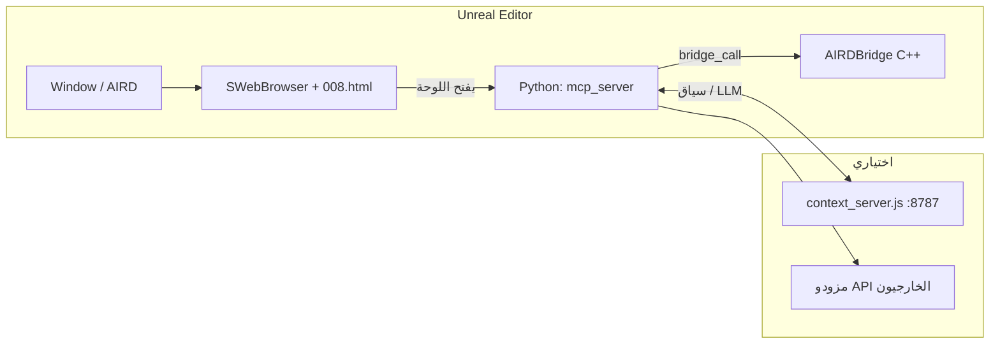

# تحليل مشروع AIRD — ملخص تقني شامل

**المسار:** `Plugins/AIRD`  
**النوع:** إضافة Unreal Engine 5.7 (محرر فقط)  
**الاسم الودي:** AIRD — AI-Ready Development Assistant for Unreal Engine  
**تاريخ التحليل:** 2026-04-11  

---

## 1. نظرة عامة

**AIRD** يجمع بين:

- **C++ (محرر):** جسر للمحرر (`AIRDBridge`)، نظام فرعي (`AIRDSubsystem`) لتنفيذ أوامر من JSON، ووحدة `AIRDEditor` تفتح لوحة ويب داخل المحرر.
- **Python (داخل Unreal):** خادم WebSocket يشبه MCP (`Content/Python/server.py` + `mcp_server.py`) يعمل على المنفذ الافتراضي `8765`، مع تكامل LLM وسياق المشهد.
- **Node.js (خارج المحرر اختياريًا):** `context_server.js` يوفر HTTP للمزامنة مع المشهد، الذاكرة السياقية، ومسار LLM (`8787` افتراضيًا).
- **واجهة ويب:** HTML/JS (`008.html`, `frontend.js`, `AIRDPro.html`) تُعرض عبر `SWebBrowser` في تبويب المحرر.

الهدف العام: مساعد تطوير يعتمد على الذكاء الاصطناعي يقرأ حالة المشهد ويصدر أوامر (إنشاء/تحريك/Blueprint وغيرها) عبر جسر موحّد.

---

## 2. هيكل المجلدات (المصدر ذو الصلة)

| المسار | الدور |
|--------|--------|
| `AIRD.uplugin` | تعريف الإضافة، المحركات، التبعيات على إضافات المحرر |
| `Source/AIRD/` | الوحدة الأساسية: الجسر، الأوامر، `EditorSubsystem` |
| `Source/AIRDEditor/` | تسجيل التبويب، القائمة، تحميل الواجهة وتشغيل بايثون التمهيدي |
| `Content/Python/` | خادم MCP، أدوات المشهد، توليد Blueprint، الرسم البياني المكاني |
| `Scripts/` | `run_mcp_in_unreal.py`، تثبيت الحزم، تشغيل خادم السياق |
| `context_server.js` | خادم سياق HTTP (Node) |
| `Content/UI/` | واجهات HTML/JS |
| `Config/FilterPlugin.ini` | استثناءات من التعبئة عند التوزيع |
| `_Package/` | نسخة/حزمة مكررة من الملفات (غالبًا للنشر) |
| `Intermediate/`, `Binaries/` | مخرجات البناء — لا تُعدّ جزءًا من المنطق |

---

## 3. وحدات Unreal (C++)

### 3.1 `AIRD` (Editor module)

- **`UAIRDSubsystem`** (`UEditorSubsystem`): الدالة `ExecuteCommand(CommandName, PayloadJson)` توجّه إلى أحد الأوامر:
  - `spawn_actor` → `FSpawnActorCommand`
  - `move_actor` → `FMoveActorCommand`
  - `generate_blueprint` → `FGenerateBlueprintCommand`
- **`UAIRDBridge`** (`UBlueprintFunctionLibrary`): واجهة ثابتة لـ Blueprint وPython عبر `unreal.AIRDBridge`:
  - جمع الممثلين وJSON (`GetActorsAsJSON`)
  - لقطة شاشة للمنفذ (Base64 PNG)
  - `SpawnActorFromDescription` (منطق بسيط: كلمات مثل cube/box → `AStaticMeshActor`)
  - `MoveActorToLocation`
  - `GenerateBlueprintFromPrompt` — إنشاء Blueprint فارغ تقريبًا تحت `/Game/AIRD/...`
  - `ExecutePythonCommand` — تمرير أوامر لـ `PythonScriptPlugin`

**معيار اللغة:** C++20 (`AIRD.Build.cs`, `AIRDEditor.Build.cs`).

**تبعيات بارزة في `AIRD.Build.cs`:** Core, Engine, Json, HTTP, WebSockets (معلنة)، UnrealEd, PythonScriptPlugin, ImageWrapper, Kismet, AssetTools، إلخ.

### 3.2 `AIRDEditor`

- عند التشغيل: تسجيل Nomad tab باسم `AIRDMainTab`، وإدخال في `LevelEditor.MainMenu.Window` لفتح النافذة.
- **`SpawnAIRDWidgetTab`:** عند فتح التبويب:
  1. يبني أمر Python يضيف `Content/Python` و`Scripts` إلى `sys.path` ويشغّل `Scripts/run_mcp_in_unreal.py` عبر `UAIRDBridge::ExecutePythonCommand`.
  2. يحمّل `008.html` من جذر الإضافة أو `Content/UI/008.html`.
  3. يعرض `SWebBrowser` بدون شريط تحكم للمتصفح.

---

## 4. طبقة Python

| الملف | الوظيفة |
|-------|---------|
| `mcp_server.py` | تشغيل `run_server` في خيط خلفي (منفذ 8765)، منع التشغيل المزدوج |
| `server.py` | خادم WebSocket كبير: JSON-RPC، مزودو LLM متعددون (OpenAI, OpenRouter, Anthropic, Together, Ollama, LM Studio)، مزامنة سياق المشهد مع `context_server`، أوامر نصية/دُفعات، استدعاء جسر Unreal عبر `run_utils.bridge_call` |
| `scene_perception.py` | `get_scene_context()` يفضّل JSON من `AIRDBridge.GetActorsAsJSON`، مع fallback لعالم المحرر عبر `unreal` API |
| `run_utils.py` | `bridge_call` — استدعاء دوال على `unreal.AIRDBridge` بأسماء مرشحة متعددة |
| `blueprint_generator.py` | منطق توليد Blueprint (يُستورد من `server`) |
| `knowledge_graph.py` | بناء رسم بياني مكاني للمشهد |
| `__init__.py` | حزمة بايثون |

**اعتماديات خارجية:** `websockets`، `pillow` (من `install_dependencies.bat` الذي يشير إلى Python المرفق مع UE 5.7).

**السجلات:** `Content/Python/AIRD_MCP.log`.

---

## 5. خادم السياق (Node.js) — `context_server.js`

- يعمل على `HOST`/`PORT` عبر متغيرات البيئة (افتراضيًا `127.0.0.1:8787`).
- يحتفظ بذاكرة سطر زمني في ملف (مثل `%LOCALAPPDATA%\AIRD\context_memory.json` أو بجانب السكربت).
- يوفّر مسارات مثل `/health`, `/scene-sync`, `/llm/chat` (تفاصيل كاملة في `MCP_SETUP.md`).
- يكمّل بايثون داخل Unreal عندما تريد طبقة HTTP موحّدة خارج عملية المحرر.

---

## 6. الواجهة الأمامية (Web)

- **`008.html`** / **`Content/UI/008.html`:** نقطة الدخول للواجهة داخل `SWebBrowser`.
- **`frontend.js`:** منطق الواجهة والاتصال (موجود أيضًا في الجذر و`Content/UI`).
- **`AIRDPro.html`:** واجهة بديلة/متقدمة محتملة.

الواجهة تعتمد على `file://` لتحميل الملفات المحلية من مسار الإضافة.

---

## 7. تدفق تشغيل نموذجي

1. المستخدم يفتح **Window → AIRD**.
2. يُشغَّل بايثون التمهيدي ويبدأ WebSocket على `8765` (مرة واحدة).
3. الواجهة تتواصل مع الخادم؛ الخادم يقرأ المشهد عبر الجسر وقد يوجّه الدردشة إلى مزود خارجي أو إلى `context_server`.

---

## 8. عقود الأوامر (JSON) — `UAIRDSubsystem`

| الأمر | الحقول المتوقعة |
|--------|------------------|
| `spawn_actor` | `description`, اختياري `location` {x,y,z} |
| `move_actor` | `actor_name`, `new_location` {x,y,z} |
| `generate_blueprint` | `prompt` (يُستخدم لتسمية الأصل) |

---

## 9. تبعيات إضافات Unreal (`AIRD.uplugin`)

- `PythonScriptPlugin`
- `WebBrowserWidget`
- `EditorScriptingUtilities`

بدونها قد يفشل البناء أو التشغيل كما هو مصمم.

---

## 10. نقاط قوة

- فصل واضح: C++ للجسر السريع، Python للمنطق المرن وMCP/LLM.
- دعم عدة مزودي نماذج في `server.py`.
- `scene_perception` يحاول مصادر متعددة للعالم لتقليل الفشل في المحرر.
- توثيم أولي جيد في `MCP_SETUP.md`.

---

## 11. قيود وملاحظات

- **`SpawnActorFromDescription`:** منطق الإنشاء مبسّط جدًا (ليس تعيين StaticMesh لمجسم مكعب حقيقي إلا عبر فئة عامة).
- **`GenerateBlueprintFromPrompt`:** ينشئ Blueprint أساسيًا فارغًا من `AActor` — ليس “توليدًا من الوصف” بالمعنى العميق دون توسيع إضافي.
- **نسخ `_Package`:** ازدواجية مع الجذر؛ يحتاج استراتيجية واضحة (مصدر واحد للحقيقة) لتجنب التعارض.
- **أدوات البناء `Intermediate/`:** يجب عدم اعتبارها مصدرًا للمراجعة؛ المصدر هو `Source/` و`Content/`.
- **الأمان:** مفاتيح API عبر متغيرات بيئة؛ التأكد من عدم تسريبها في السجلات عند المشاركة.

---

## 12. توصيات عملية (اختيارية)

1. توحيد مسار الواجهة (جذر vs `Content/UI`) في وثيقة واحدة وتقليل التكرار.
2. إضافة اختبارات يدوية/تلقائية لعقد `ExecuteCommand` مقابل أمثلة JSON ثابتة.
3. مراجعة ما إذا كانت وحدات `HTTP`/`WebSockets` في C++ مستخدمة فعليًا أو يمكن تقليل التبعيات إن لم تُستخدم في C++.

---

## 13. ملخص سطر واحد

**AIRD** إضافة محرر لـ UE 5.7 تجمع جسر C++ (`AIRDBridge` + أوامر JSON)، خادم Python WebSocket غني بالمزودين، وواجهة ويب في التبويب، مع خادم سياق Node اختياري لدمج المشهد والذاكرة ومسارات LLM.

---

*هذا الملف مُنشأ لغرض التوثيق والمراجعة المعمارية؛ يُحدَّث عند تغيير هيكل الإضافة أو العقود.*
